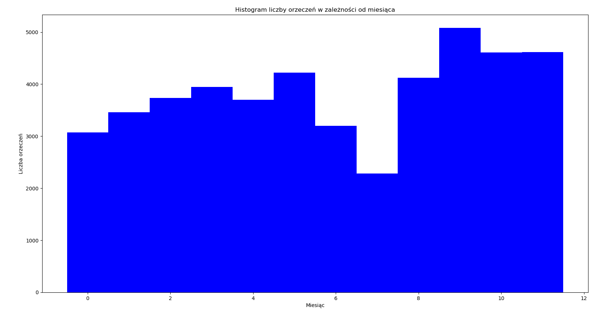

# Elasticsearch

1. Zainstaluj ElasticSearch (ES)
1. Zainstaluj w ES plugin do obsługi języka polskiego https://github.com/allegro/elasticsearch-analysis-morfologik
1. Zdefiniuj w ES analizator zawierający następujące elementy (tekst w języku polskim):
    - standardowy tokenizer
    - filtr lematyzujący oparty o morfologika
1. Zdefiniuj w ES indeks do przechowywania orzeczeń sądów zawierający następujące elementy:
    - treść orzeczenia - typu: tekst w języku polskim
    - datę orzeczenia - typu: data
    - sygnaturę orzeczenia - typu: słowo kluczowe
    - imiona i nazwiska sędziów wydających orzeczenie - typu: tablica
1. Załaduj dane z wybranego roku do ESa
1. Znajdź liczbę orzeczeń, w których występuje słowo szkoda.
1. Znajdź liczbę orzeczeń, w których występuje fraza `trwały uszczerbek na zdrowiu`, dokładnie w tej kolejności ale w dowolnej formie fleksyjnej.
1. Jak wyżej, ale z uwzględnieniem możliwości wystąpienia maksymalnie 2 dodatkowych słów pomiędzy dowolnymi elementami frazy.
1. Określ 3 sędziów, którzy wydali największą liczbę orzeczeń w danym roku, wraz z liczbą wydanych orzeczeń.
1. Przedstaw histogram liczby orzeczeń w zależności od miesiąca.

## AD.6

Liczba orzeczeń zawierających słowo "szkoda" w dowolnej formie fleksyjnej: 13680

## AD.7

Liczba orzeczeń, w których występuje fraza `trwały uszczerbek na zdrowiu`: 1098

## AD.8

Liczba orzeczeń, w których występuje fraza `trwały uszczerbek na zdrowiu` z uwzględnieniem możliwości wystąpienia maksymalnie 2 dodatkowych słów pomiędzy dowolnymi elementami frazy: 1140

## AD.9

    1. Urszula Iwanowska - 442 orzeczeń
    2. Beata Górska - 418 orzeczeń
    3. Anna Polak - 404 orzeczeń

## AD.10

