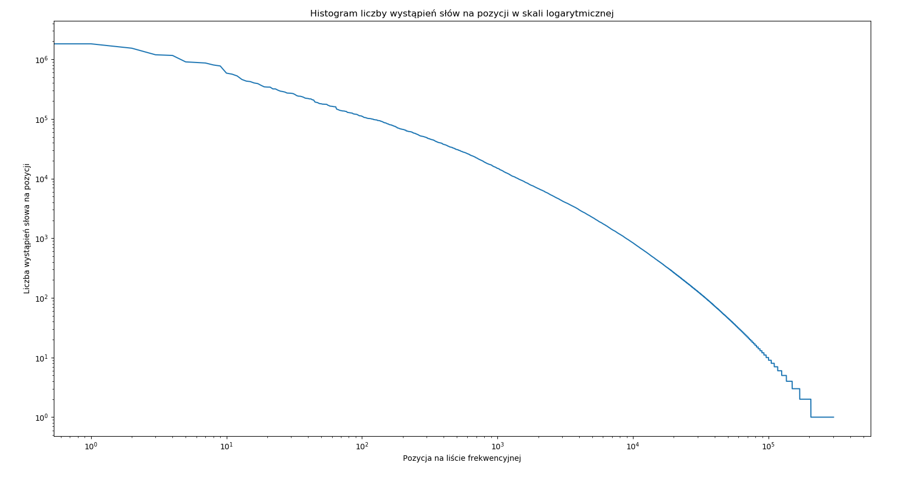

# Korekta tekstu i odległość Levenshteina

1. Podziel tekst wszystkich orzeczeń z określonego roku na słowa.
1. Oblicz i utrwal listę frekwencyjną słów (liczbę wystąpień posortowaną względem malejącej liczby wystąpień słów). Przykładowo, jeśli korpus zawiera zdanie "Ala Ala, kot", to lista frekwencyjna dla tego korupusu jest następująca:
    - Ala: 2
    - kot: 1
1. Z listy frekwencyjnej usuń pozycje, które nie stanowią słów (np. są to pojedyncze litery występujące w zanonimizowanej wersji nazw własnych). Usuń również wszystkie wartości, które nie są zapisane literami (w szczególności liczby).
1. W skali logarytmicznej przedstaw wykres, w którym na osi X są pozycje na liście frekwencyjnej, a na osi Y liczba wystąpień słowa zajmującego określoną pozycję.
1. Korzystając z pliku [polimorfologik.zip](https://github.com/morfologik/polimorfologik/releases) znajdź wszystkie słowa, które nie znajdują się w tym słowniku.
1. Przedstaw 30 przykładowych słów, które nie należą do słownika.
1. Korzystając z algorytmu korekty słów oraz listy frekwencyjnej, określ najbardziej prawdopodobną korektę słów, które nie występują w słowniku.

## AD.4

## AD.6

30 przykładowych słów, które nie należą do słownika:

    wstrzykiwaczach
    szukało
    nabywającymi
    kupisz
    niędzmi
    głucha
    zaworze
    używania
    płaczei
    kazały
    oponowym
    ostać
    domowe
    powdowego
    wymieniających
    kontrolowany
    wychłodzony
    ogólniej
    podjetego
    dąc
    upiększał
    odrealnienia
    polistyrenowych
    niedosłyszącej
    lancer
    dobryszyce
    nawrotowym
    podartych
    wyłudzono
    jubileuszowych

## AD.7

30 przykładowych poprawionych słów, które nie należą do słownika:

    pcchzig => puchnie
    skype => skąpe
    międzypalcowych => międzykolcowych
    stalił => ustalił
    odróżenienia => odróżnienia
    przytsepującym => przystępującym
    wiertnicznych => wiertniczych
    kasatoryjna => kasatoryjne
    badaniowych => zadaniowych
    pseudohiperteloryzmem => pseudopatriotyczne
    mikrozłamania => mikrozałamania
    logicznojęzykowa => pozajęzykowa
    nieopomiarowanie => nieopomiarowane
    inowrocławiuz => inowrocławiu
    nieprzyznananiu => nieprzyznawaniu
    rzporządzenia => rozporządzenia
    nadreaktywność => nadreaktywności
    zotał => został
    dwuportowych => dwutorowych
    inplantu => implantu
    polikwidacyjnej => polikwidacyjne
    faecalis => faecaiis
    dopłodowej => dowodowej
    chłodziarkis => chłodziarki
    dystylnie => dystalnie
    tylnokomorową => tylnokomorowe
    iniematerialnych => niematerialnych
    cbś => coś
    średniostatystyczny => średniostatystycznej
    bundle => kundle
