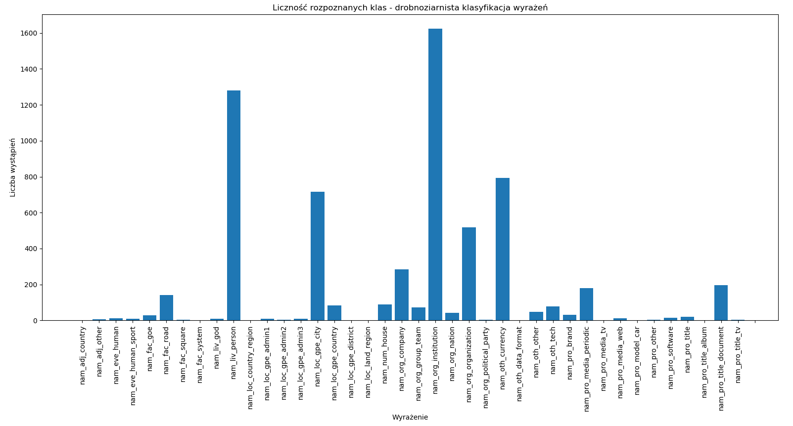
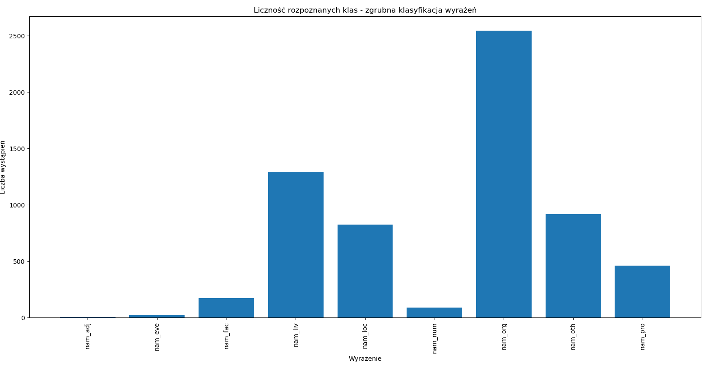

# Rozpoznawanie jednostek nazewniczych

1. Zapoznaj się z klasyfikacją jednostek nazewniczych dostępną w dokumencie [Wytyczne KPWr - jednostki identyfikacyjne](http://clarin-pl.eu/pliki/warsztaty/WytyczneKPWr-JednostkiIdentyfikacyjne.pdf).
1. Zapoznaj się z [API serwisu NER](http://nlp.pwr.wroc.pl/redmine/projects/nlprest2/wiki) w systemie [Clarin](http://ws.clarin-pl.eu/ner.shtml).
1. Wybierz 100 pierwszych (sortując wg daty) orzeczeń w danym roku.
1. Z dokumentów usuń znaczniki HTML (jeśli występują).
1. Rozpoznaj jednostki nazewnicze w dokumentach, korzystając z API Clarin oraz wykorzystując model n82.
1. Przedstaw liczność rozpoznanych klas w postaci dwóch wykresów:
    - na pierwszy wykresie przedstaw drobnoziarnistą klasyfikację wyrażeń, tzn. uwzględniając klasy takie jak nam_fac_bridge, nam_liv_animal, nam_loc_gpe, itd.,
    - na drugim wykresie przedstaw zgrubną klasyfikację wyrażeń. tzn. uwzględniając klasy takie jak nam_adj, nam_eve, nam_fac, nam_liv, itd.
1. Przedstaw 100 najczęściej rozpoznanych wyrażeń, wraz z podaniem liczby ich wystąpień oraz kategorii semantycznej (tzn. niskopoziomowej (drobnoziarnistej) klasy przypisanej przez NER).
1. Przedstaw 10 najczęstszych wyrażeń, dla każdej wysokopoziomowej (zgrubnej) klasy wyrażeń.
1. Oceń przydatność NERa dla danych jakimi są orzeczenia sądów.

## AD.5

'any2txt|wcrft2|liner2({"model":"n82"})'

## AD.6

## AD.7

    (('nam_oth_currency', 'zł'), 467)
    (('nam_oth_currency', 'złotych'), 268)
    (('nam_org_organization', 'SIWZ'), 241)
    (('nam_liv_person', 'Zamawiającego'), 155)
    (('nam_pro_media_periodic', '. U . Dz'), 152)
    (('nam_org_institution', 'Okręgowy Sąd'), 98)
    (('nam_loc_gpe_city', 'Warszawie'), 89)
    (('nam_org_institution', 'Najwyższego Sądu'), 69)
    (('nam_org_institution', 'Apelacyjny Sąd'), 61)
    (('nam_org_institution', 'Okręgowego Sądu'), 60)
    (('nam_loc_gpe_city', 'Warszawa'), 53)
    (('nam_org_institution', 'Odwoławczej Izby Krajowej Prezesa'), 51)
    (('nam_org_institution', 'Najwyższy Sąd'), 50)
    (('nam_liv_person', 'Zamawiający'), 49)
    (('nam_org_institution', 'Rejonowy Sąd'), 48)
    (('nam_org_institution', 'Konstytucyjny Trybunał'), 43)
    (('nam_org_institution', 'Lubelskim Janowie w Rejonowego Sądu'), 42)
    (('nam_pro_title_document', 'publicznych zamówień Prawo'), 41)
    (('nam_org_institution', 'Odwoławcza Izba Krajowa'), 40)
    (('nam_org_institution', 'Dnia POLSKIEJ RZECZYPOSPOLITEJ IMIENIU'), 39)
    (('nam_org_institution', 'Rejonowego Sądu'), 39)
    (('nam_liv_person', 'M'), 38)
    (('nam_org_institution', 'Państwa Skarbu'), 38)
    (('nam_oth_currency', 'PLN'), 38)
    (('nam_org_organization', 'L'), 34)
    (('nam_org_institution', 'Apelacyjnego Sądu'), 34)
    (('nam_org_institution', 'Konstytucyjnego Trybunału'), 34)
    (('nam_loc_gpe_city', 'Wrocławiu'), 33)
    (('nam_org_institution', 'Państwa Skarb'), 33)
    (('nam_liv_person', 'Odwołującego'), 33)
    (('nam_loc_gpe_country', 'Polsce'), 33)
    (('nam_org_institution', 'TK'), 33)
    (('nam_loc_gpe_city', 'Katowicach'), 30)
    (('nam_oth_other', 'VAT'), 28)
    (('nam_liv_person', 'D . P'), 27)
    (('nam_org_organization', 'P'), 26)
    (('nam_liv_person', 'Zamawiającemu'), 25)
    (('nam_org_institution', 'Sprawiedliwości Ministra'), 24)
    (('nam_org_institution', 'Ministrów Rady Prezesa'), 23)
    (('nam_liv_person', 'Construcciones Aldesa'), 21)
    (('nam_liv_person', 'P . J'), 20)
    (('nam_org_organization', 'M'), 19)
    (('nam_org_nation', 'Usługodawców'), 19)
    (('nam_org_company', 'AMETEL'), 19)
    (('nam_loc_gpe_city', 'Krakowie'), 18)
    (('nam_liv_person', 'D . J'), 18)
    (('nam_num_house', '11'), 18)
    (('nam_liv_person', 'Najwyższego'), 17)
    (('nam_loc_gpe_city', 'Gdyni'), 17)
    (('nam_liv_person', 'L'), 16)
    (('nam_liv_person', 'D'), 16)
    (('nam_org_organization', 'VAT'), 16)
    (('nam_liv_person', 'Odwołujący'), 16)
    (('nam_liv_person', 'M . J'), 16)
    (('nam_loc_gpe_city', 'Górze Jeleniej'), 16)
    (('nam_oth_tech', 'SAN'), 16)
    (('nam_loc_gpe_city', 'Łodzi'), 15)
    (('nam_fac_road', 'Waliców'), 15)
    (('nam_oth_tech', 'EURODOME'), 15)
    (('nam_liv_person', 'S . L'), 14)
    (('nam_org_institution', 'Konsumentów i Konkurencji Ochrony Sąd'), 14)
    (('nam_oth_tech', 'IBM'), 14)
    (('nam_loc_gpe_city', 'Kraków'), 14)
    (('nam_liv_person', 'Śledczego'), 14)
    (('nam_org_institution', 'Ministrów Rady'), 13)
    (('nam_org_organization', 'Europejskiej Unii'), 13)
    (('nam_pro_media_periodic', 'Europejskiej Unii Urzędowym Dzienniku'), 13)
    (('nam_liv_person', 'M . M'), 13)
    (('nam_org_institution', 'VAT'), 13)
    (('nam_loc_gpe_city', 'Rzeszów'), 13)
    (('nam_org_institution', 'Odwoławczej Izby Krajowej'), 13)
    (('nam_loc_gpe_city', 'Wrocławia'), 13)
    (('nam_fac_road', 'Krajowych Dróg'), 13)
    (('nam_org_institution', 'Społecznych Ubezpieczeń Funduszu'), 12)
    (('nam_org_institution', 'Sąd'), 12)
    (('nam_loc_gpe_city', 'Legnicy'), 12)
    (('nam_loc_gpe_city', 'Poznaniu'), 12)
    (('nam_liv_person', 'Al'), 12)
    (('nam_liv_person', 'Wykonawca'), 12)
    (('nam_oth_other', 'SIWZ 1 . 4'), 12)
    (('nam_loc_gpe_city', 'Śledczym Areszcie'), 12)
    (('nam_loc_gpe_city', 'Miasta Gminy'), 12)
    (('nam_loc_gpe_country', 'Polska'), 12)
    (('nam_liv_person', 'Strabag Odwołujący'), 12)
    (('nam_loc_gpe_city', 'Formularzu'), 12)
    (('nam_liv_person', 'G . S'), 12)
    (('nam_org_organization', 'C'), 11)
    (('nam_org_institution', 'Publicznych Zamówień Urzędu'), 11)
    (('nam_loc_gpe_city', 'Izby'), 11)
    (('nam_liv_person', 'Limited MacDonald Mott'), 11)
    (('nam_liv_person', 'Najwyższy'), 11)
    (('nam_num_house', '32'), 11)
    (('nam_liv_person', 'Usługodawcy'), 11)
    (('nam_pro_title_document', 'FUS z rentach i emeryturach o ustawy'), 10)
    (('nam_loc_gpe_city', 'Szczecinie'), 10)
    (('nam_org_institution', 'Zamówienia Warunków Istotnych Specyfikacji'), 10)
    (('nam_num_house', '3'), 10)
    (('nam_loc_gpe_city', 'Rzeszowie'), 10)
    (('nam_liv_person', 'J'), 10)
    (('nam_org_organization', 'PUP'), 10)

## Ad.8

    nam_org
        ('SIWZ', 241)
        ('Okręgowy Sąd', 98)
        ('Najwyższego Sądu', 69)
        ('Apelacyjny Sąd', 61)
        ('Okręgowego Sądu', 60)
        ('Odwoławczej Izby Krajowej Prezesa', 51)
        ('Najwyższy Sąd', 50)
        ('Rejonowy Sąd', 48)
        ('L', 43)
        ('Konstytucyjny Trybunał', 43)
    nam_loc
        ('Warszawie', 89)
        ('Warszawa', 53)
        ('Wrocławiu', 33)
        ('Polsce', 33)
        ('Katowicach', 30)
        ('Krakowie', 18)
        ('Gdyni', 17)
        ('Górze Jeleniej', 16)
        ('Łodzi', 15)
        ('Kraków', 14)
    nam_liv
        ('Zamawiającego', 155)
        ('Zamawiający', 49)
        ('M', 38)
        ('Odwołującego', 33)
        ('D . P', 27)
        ('Zamawiającemu', 25)
        ('Construcciones Aldesa', 21)
        ('P . J', 20)
        ('D . J', 18)
        ('Najwyższego', 17)
    nam_pro
        ('. U . Dz', 152)
        ('publicznych zamówień Prawo', 41)
        ('Europejskiej Unii Urzędowym Dzienniku', 13)
        ('FUS z rentach i emeryturach o ustawy', 10)
        ('Spółka Polska MacDonald Mott', 7)
        ('2EE CR0', 7)
        ('cywilnego Kodeksu', 6)
        ('społecznych ubezpieczeń systemie o ustawy', 6)
        ('Ministrów Rady rozporządzenia', 5)
        ('Sprawiedliwości Ministra Rozporządzenia', 5)
    nam_oth
        ('zł', 467)
        ('złotych', 268)
        ('PLN', 38)
        ('VAT', 36)
        ('SAN', 16)
        ('EURODOME', 15)
        ('IBM', 14)
        ('SIWZ 1 . 4', 12)
        ('euro', 9)
        ('C', 5)
    nam_fac
        ('Waliców', 15)
        ('Krajowych Dróg', 13)
        ('Łopuszańska', 10)
        ('C5', 6)
        ('Legionów', 5)
        ('Szamocka', 4)
        ('18 Dekerta', 4)
        ('Osiedlowa', 4)
        ('Bodycha', 4)
        ('Najświętszej', 4)
    nam_eve
        ('8 House MacDonald Mott Limited MacDonald Mott', 7)
        ('London East Kolejowej Linii Projektu techniczne Doradztwo', 3)
        ('London East Kolejowej Linii', 3)
        ('Karnym Zakładzie', 2)
        ('2011 OSNP', 1)
        ('Mikrokodu', 1)
        ('Certificate s ’ Client', 1)
        ('3 Euro', 1)
        ('Archiwum Elektronicznego', 1)
        ('T5518A LTU Upgrade', 1)
    nam_num
        ('11', 18)
        ('32', 11)
        ('3', 10)
        ('6', 5)
        ('20', 5)
        ('1', 4)
        ('18', 4)
        ('16', 3)
        ('181', 3)
        ('13', 3)
    nam_adj
        ('unijnego', 2)
        ('taksówkarskich', 1)
        ('europejskiej', 1)
        ('Polskiej', 1)
        ('internetowej', 1)
        ('polskiej', 1)

## Ad.9

Na podstawie wyników można łatwo rozpoznać typ tekstu.
