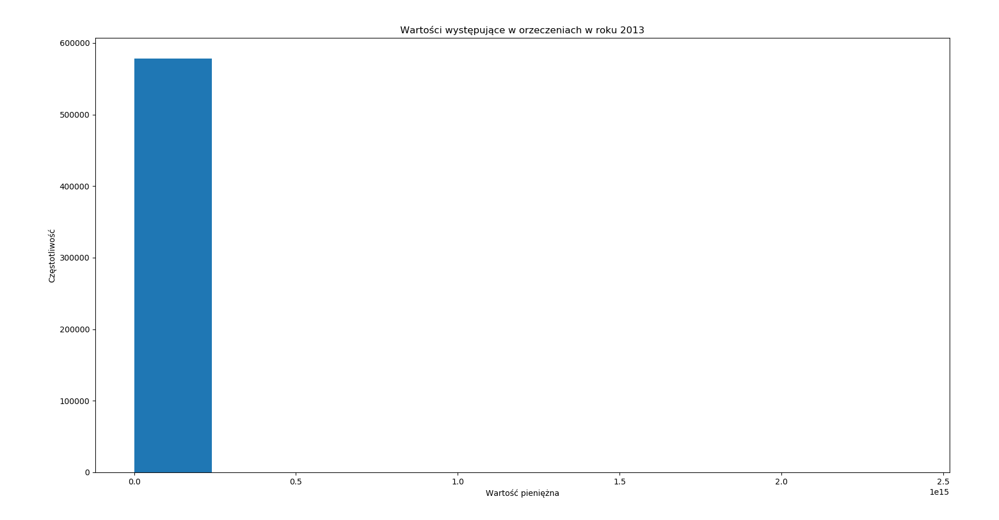
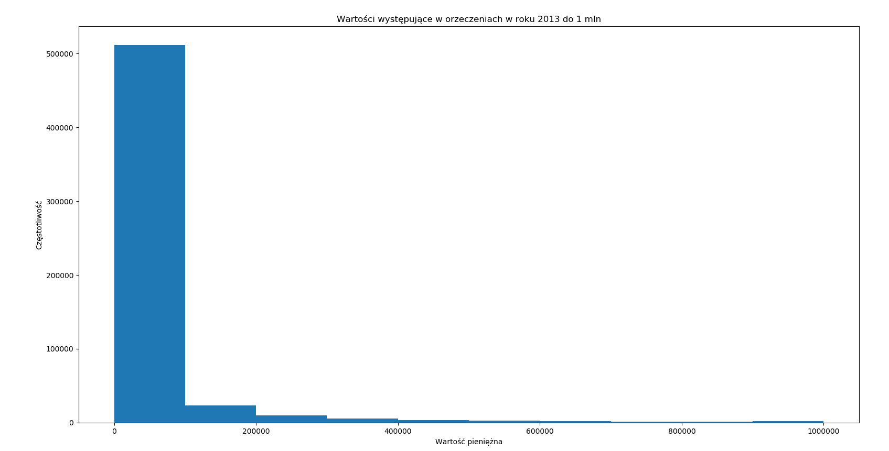
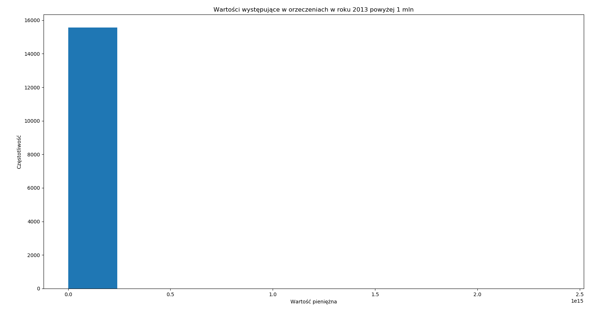

# Wyrażenia regularne

1. Wydostań wszystkie **wartości pieniężne wyrażone w złotych** pojawiające się tekstach orzeczeń określonego roku, znormalizuj je i przedstaw ich
   rozkład w postaci histogramu.
1. Jak w punkcie 1. ale zrób osobny wykres dla wartości **do 1 mln zł.** oraz **powyżej 1 mln zł.**
1. Określ liczbę orzeczeń odwołujących się w określonym roku do **artykułu 445 Ustawy z dnia 23 kwietnia 1964 r. - Kodeks cywilny**.
1. Określ liczbę orzeczeń w określonym roku, które zawierają słowo **szkoda** w dowolnej formie fleksyjnej. Wynik ten
   nie może obejmować innych słów, które mają wspólny prefiks ze słowem szkoda, np. *szkodzić*, *szkodzący*, itp.

## AD.1

## AD.2

## AD.3

Liczba orzeczeń odwołujących się do artykułu 445 Ustawy z dnia 23 kwietnia 1964 r. - Kodeks cywilny: 1946

## AD.4

Liczba orzeczeń zawierających słowo "szkoda" w dowolnej formie fleksyjnej 17405
