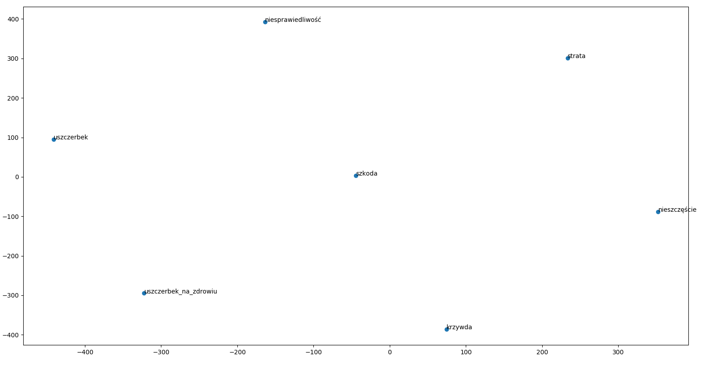

# Word2Vec

1. Zapoznaj się z dokumentacją modelu [word2vec w bibliotece Gensim](https://radimrehurek.com/gensim/models/word2vec.html).
1. Z korpusu orzeczeń wyselekcjonuj dane, tak, żeby mieć minimum 1GB tekstu.
1. Oczyść dane usuwając z nich znaczniki HTML oraz usuwając podziały słów na końcach linii.
1. Korzystając z wbudowanego w Gensim [mechanizmu wykrywania wyrażeń wielosegmentowych](https://radimrehurek.com/gensim/models/phrases.html#id2) wykryj frazy składające się z maksymalnie 3 słów, korzystając z domyślnych ustawień biblioteki.
1. Dla tak przygotowanego zbioru danych wytrenuj model word2vec o następujących parametrach:
    - model: CBOW
    - okno: 5
    - rozmiar wektora: 300
    - minimalna liczba występień: 3
1. Zapisz wytrenowany model na dysku.
1. Znajdź 3 najbardziej podobne wyrażenia (słowa i zwroty) dla następujących wyrażeń:
    - Sąd Najwyższy
    - Trybunał Konstytucyjny
    - kodeks cywilny
    - kpk
    - sąd rejonowy
    - szkoda
    - wypadek
    - kolizja
    - szkoda majątkowa
    - nieszczęście
    - rozwód
1. Znajdź wypadkową operacji na słowach (5 najbliższych wyników)
    - Sąd Najwyższy - kpc + konstytucja
    - pasażer - mężczyzna + kobieta
    - samochód - droga + rzeka
1.Korzystając z algorytmu [t-SNE](http://scikit-learn.org/stable/modules/generated/sklearn.manifold.TSNE.html) przedstaw projekcję wektorów następujących słów na płaszczyznę:
    - szkoda
    - strata
    - uszczerbek
    - szkoda majątkowa
    - uszczerbek na zdrowiu
    - krzywda
    - niesprawiedliwość
    - nieszczęście

## Ad.7

    Sąd_Najwyższy
        'Sąd_Najwyższy,', 0.8129898905754089
        'Trybunał_Konstytucyjny', 0.6764003038406372
        'Trybunał', 0.6716378927230835
    Trybunał_Konstytucyjny
        'Trybunał', 0.9397224187850952
        'Trybunał_Konstytucyjny,', 0.8215391635894775
        'Trybunał,', 0.813628077507019
    kodeks_cywilny
        'Kodeks_pracy', 0.7980093955993652
        'Kodeks_cywilny', 0.7941955327987671
        'kodeks_postępowania_cywilnego', 0.7539806962013245
    kpk
        'kpk,', 0.8113726377487183
        'kpk)', 0.7931006550788879
        'kk', 0.7911224365234375
    sąd_rejonowy
        'sąd_apelacyjny', 0.7189524173736572
        '(sąd', 0.7032870650291443
        'sąd_właściwy', 0.6818021535873413
    szkoda
        'krzywda', 0.7928489446640015
        'szkoda,', 0.7827692031860352
        'Szkoda', 0.7716143131256104
    wypadek
        'przypadek', 0.7776857614517212
        'wypadek,', 0.7367169857025146
        'Wypadek', 0.6562826633453369
    kolizja
        'dysproporcja', 0.7396142482757568
        'relacja', 0.7084054946899414
        'luka', 0.7073505520820618
    szkoda_majątkowa
        Nie wystąpiło w słowniku.
    nieszczęście
        '480;', 0.7080918550491333
        '360;', 0.7026132941246033
        'męskie,', 0.7011219263076782
    rozwód
        'rozwód,', 0.7571243643760681
        'separację', 0.7037941813468933
        'przez_rozwód', 0.6236369609832764

## Ad.8

    Sąd Najwyższy - kpc + konstytucja
        'Konstytucja', 0.49939578771591187
        'Naczelny_Sąd_Administracyjny', 0.49430274963378906
        'Trybunał_wielokrotnie', 0.4905399978160858
        'Trybunał_Konstytucyjny', 0.4838156998157501
        'Trybunał', 0.4765018820762634
    pasażer - mężczyzna + kobieta
        'pasażerka', 0.7400874495506287
        'obywatelka', 0.6115729808807373
        'żona_powoda', 0.6009452939033508
        'opiekunka', 0.5974345803260803
        'ofiara', 0.5924198627471924
    samochód - droga + rzeka
        'telefon_komórkowy', 0.6609154939651489
        'pistolet', 0.6444844007492065
        'samochód_marki', 0.6388850808143616
        'Samochód', 0.6273850798606873
        'ciągnik', 0.6146700382232666

## AD.9

