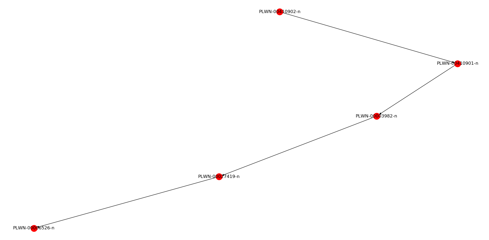
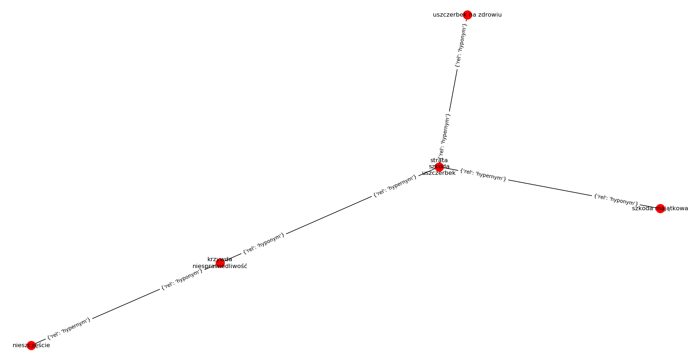
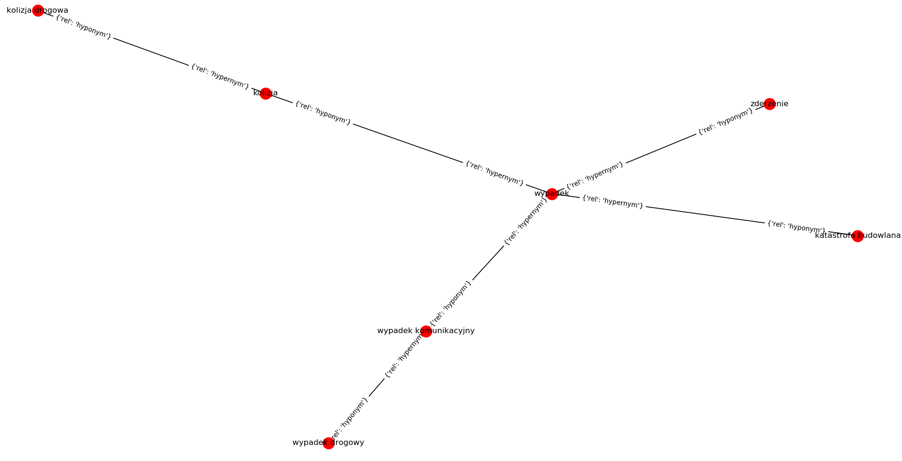

# Słowosieć (WordNet)

1. Zapoznaj się z [API Słowosieci](http://api.slowosiec.clarin-pl.eu/docs/index.html)
1. Zapoznaj się z [relacjami Słowosieci](http://nlp.pwr.wroc.pl/narzedzia-i-zasoby/narzedzia/disaster/25-wiedza/81-relacje-w-slowosieci)
1. Znajdź wszystkie znaczenia rzeczownika szkoda oraz wymień ich synonimy (jeśli posiadają).
1. Znajdź domknięcie przechodnie relacji hiperonimi dla pierwszego znaczenia wyrażenia wypadek drogowy i przedstaw je w postaci grafu skierowanego.
1. Znajdź bezpośrednie hiponimy rzeczownika wypadek1.
1. Znajdź hiponimy drugiego rzędu dla rzeczownika wypadek1.
1. Przedstaw w postaci grafu skierowanego (z etykietami dla krawędzi) relacje semantyczne pomiędzy następującymi grupami leksemów:
    - szkoda2, strata1, uszczerbek1, szkoda majątkowa1, uszczerbek na zdrowiu1, krzywda1, niesprawiedliwość1, nieszczęście2.
    - wypadek1, wypadek komunikacyjny1, kolizja2, zderzenie2, kolizja drogowa1, bezkolizyjny2, katastrofa budowlana1, wypadek drogowy1.
1. Znajdź wartość miary pokrewieństwa semantycznego Leacocka-Chodorowa ftp://www-vhost.cs.toronto.edu/public_html/public_html/pub/gh/Budanitsky+Hirst-2001.pdf pomiędzy następującymi parami leksemów:
    - szkoda2 - wypadek1
    - kolizja2 - szkoda majątkowa1
    - nieszczęście2 - katastrofa budowlana1

## Ad.3

    PLWN-00003675-n  {strata:1, utrata:1, szkoda:2, uszczerbek:1}  ()
    PLWN-00006533-n  {szkoda:1}  (brak danych)

## Ad.4

    PLWN-00410902-n  {wypadek drogowy:1}  ()
    PLWN-00410901-n  {wypadek komunikacyjny:1}  ()
    PLWN-00003982-n  {wypadek:1}  ()
    PLWN-00027419-n  {zdarzenie oceniane negatywnie:1}  (brak danych)
    PLWN-00006526-n  {wydarzenie:1, wypadek:3, zdarzenie:2, historia:3}  ()

## Ad.5

    PLWN-00001284-n  {zderzenie:2, kraksa:1}  ()
    PLWN-00006486-n  {kolizja:2}  ()
    PLWN-00016131-n  {karambol:1}  ()
    PLWN-00034688-n  {zawał:2}  ()
    PLWN-00034689-n  {tąpnięcie:1}  ()
    PLWN-00241026-n  {kapotaż:1}  ()
    PLWN-00258639-n  {wykolejenie:2}  ()
    PLWN-00389170-n  {zakrztuszenie:1, zachłyśnięcie:1, aspiracja:3}  ()
    PLWN-00410901-n  {wypadek komunikacyjny:1}  ()
    PLWN-00411618-n  {katastrofa budowlana:1}  ()
    PLWN-00436137-n  {wypadek jądrowy:1}  ()

## Ad.6

    PLWN-00235346-n  {czołówka:9, zderzenie czołowe:1}  ()
    PLWN-00471555-n  {stłuczka:1}  ()
    PLWN-00441365-n  {kolizja drogowa:1}  ()
    PLWN-00037295-n  {obwał:1}  ()
    PLWN-00410902-n  {wypadek drogowy:1}  ()

## Ad.7

szkoda2, strata1, uszczerbek1, szkoda majątkowa1, uszczerbek na zdrowiu1, krzywda1, niesprawiedliwość1, nieszczęście2.

wypadek1, wypadek komunikacyjny1, kolizja2, zderzenie2, kolizja drogowa1, bezkolizyjny2, katastrofa budowlana1, wypadek drogowy1.

## Ad.8

    szkoda - wypadek 2.8622008809294686
    kolizja - szkoda majątkowa 2.456735772821304
    nieszczęście - katastrofa budowlana 2.05127066471314
